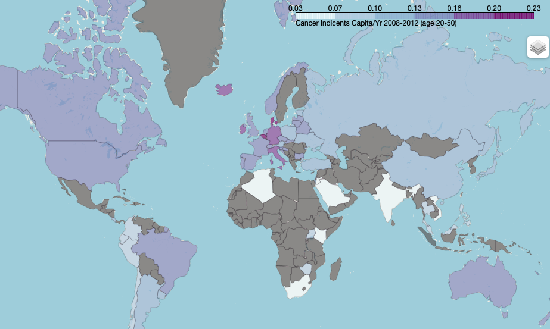

# capstone1-cancer-v-meat

Capstone I Proposal - Ann Strange
22 Oct 2020
“Forks Over Knives” Debunked?

## Background & Motivation
“The Emperor of All Maladies” (an uplifting read) points out that cancer has been around for all recorded human history.  We now know it’s a disease of genetic mutation, and also that environment can play a huge role, e.g. smoking with lung cancer or sun exposure with melanoma.  People close to me have suffered from cancer, leading me to be interested in ways to avoid this form of human suffering.   The documentary, “Forks Over Knives” promotes evidence from their study that a whole-foods based diet very significantly affects your likelihood of not getting cancer, particularly pointing to the consumption of animal products as having a direct correlation with cancer rates.  They contend that reducing the consumption of animal products including meat, fish, eggs, and dairy to below 5% of your diet will dramatically change your prognosis: actually preventing cancer as well as slowing its development.  Here lets analyze global cancer data by country compared with animal product consumption to see if we can find correlations that might support this claim.  If this claim is true, we should find that countries that eat less animal products are having lower instances of cancer.  As there are many confounders in the causes for cancer, any results will not prove/disprove the documentary, but the failure to find any correlations would make it difficult to support their claim.

## Exploratory Data Analysis
The World Health Organization (WHO) supplies a database called CI5, Cancer Incidence in Five Continents Volume XI. The CI5 database contains incidence rates from 343 cancer registries in 65 countries for cancers diagnosed from 2008 to 2012, for all cancers and 28 major types. The download of summary data provides a set of csv files. There is one with population metrics, and one for the cancer cases reported.  Population data includes columns for Registry (reporting location), Year, Sex, Total population, and remaining columns are the breakdowns by age range (every 5 years).  The Case files include columns to indicate the Registry, Year, Sex, Cancer type code, and the same 5 year age range counts. Additional files provide code definitions. 

The Our World in Data site provides a chart and downloadable .csv of meat/dairy/etc supply metrics per country and year, originally sourced from the Food and Agriculture Organization of the United Nations (FAOSTAT).  The column title is like “Meat food supply quantity (kg/capita/yr)”, a float to 2 decimal places.  Meat, fish, dairy, etc need to be downloaded as separate metrics but have the same file format.  We’ll use 2008 to be able to correspond with the time period available in C15.  

## Data Munging 
1. Cancer statistics are reported regionally by "registry".  Some areas such as the US have many sub-classifications of cancer statistics, which can be reported on multiple levels.  The data set was reduced in these case to only inlude national level data, or double-counting would occur.  Other countries such as Canada do not have a total category, so sums were done.
2.  The most complete set of cancer data I could identify was for the five year range from 2008-2012 so this was selected and divided by 5 for an annual average for this time period.
3. Meat, Egg, and Dairy are reported separately at the Kg/Capita/Country level, by year.  I selected 2008.
4. Weighted averages were used for the cancer case means, by population sample size.
5. The population was divided into top 5/6 and bottom 1/6 for comparison.

## Assumptions/Disclaimers
1. There is a strong correlation between wealth and meat consumption.  Wealth may be a confounder.
2. Some countries do not tend to report cancer statistics as thoroughly as other countries.  Countries without screening may detect cancer later.
3. Only 60 countries were compared in this analysis, where adequate data existed for both cancer stats and animal product consumption. 
4. Age is a big cancer stats confounder as the probability of getting cancer increases exponentially as people age, and the WHO strongly recommends using an Age Adjusted average for any country to country comparisons.  Instead I limited the sample to young people, between age 20 and 49.
6. To compare animal product consuming populations with non-animal consuming populations using the Two Sample Approximate Test of Population Proportions, there is an assumpition required on the independence of each "Binimial trial" i.e. each incidence of cancer in independent of the others, and this is likely to not hold true.  It would be interesting to conduct this test exluding regions such as Chernobyl and Hiroshima, or exclude cases with known causes such as smoking where external and regional factors are certainly contributing to cancer rates.
7. To represent the lowest animal product consumption, I've selected the lowest 10 countries in our set (1/6 our sample) with lower than 115 kg/capita which we'll use to represent "low" consumption.  If the average person consumes 2 kg/food and water per day, and we account for some waste**, this would come out to < 10% daily animal product consumption. For "high" consumption countries, the ratio would be closer to 25-30% of diets. 

     **[wasted food report](https://en.reset.org/knowledge/global-food-waste-and-its-environmental-impact-09122018) 

### Cancer by Country

    Sample data

    <base bar? chart, top and bottom 5>

    

### Animal Consumption Per Capita

    <base chart top and bottom 5>

images/animal_consumption.html

## Let's look at the Correlation

77% correlation

    map most correlated and least.

    stats

## Chi-Squared Test for Independence

H0: In the population, the two categorical variables are independent.

Ha: In the population, the two categorical variables are dependent.

## Hypothesis Testings

We would like to test the "Forks Over Knives" claim that consuming less animal products reduces your change of catching cancer.  

Our Null Hypothesis is that the chance of getting cancer in a low meat/dairy country would fall within normal probabilities for getting cancer, within a significance of 5%.  Our alernate hypothesis is that there is a significant difference in the probabilies. 

I usesd the * Two Sample Approximate Test of Population Proportions to analyze this*. 

The probability of getting cancer worldwide (among our 60 sample countries) is 1.3% ___.  Dividing our data set into the animal consuming set and the practically vegan set, the chance of any individual between 20 and 49 getting cancer between 2008 and 2012 is Binomial distributed

    P(cancer w meat) we'll call p_M = (0.14%)
    P(cancer as a vegan) we'll call p_V = (0.07%)

A Normal approximation is appropriate to each of these Binomial distributions, but we'll use frequency in the test so we can account for the population differences.  Our probablistic model for the difference in sample frequencies can be represented as 

\\{Difference in sample frequencies between Matt and Nick} \approx Normal \left( p_M - p_N, \sqrt{\frac{p_N(1-p_N)}{100} + \frac{p_M(1-p_M)}{80}} \right)\\

## Interesting Findings
* Using the normal distribution to test 